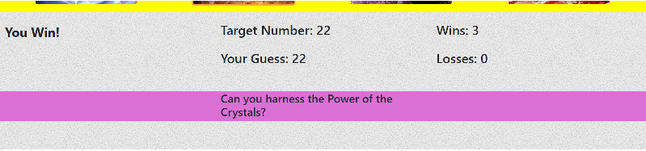

## Crystal Collector Game

### The Crystal Collector Game is a guessing game where the player needs to guess what combination of crystals will yield a number that matches the target value. The target value and number values for each crystal are generated random numbers which are different for each round but remain constant for a given round. Additionally, the value for each crystal is unique. The graphic below show that when the yellow crystal is clicked on, it adds a value of 10.
 
### If the player matches the target value, the win value increases by 1.
 
### If the player overshoots the target value, the loss value increases by 1.
 
### After a win or loss, the game starts again after a brief delay set by a timer.

### The technologies used for this game are HTML, CSS, and JQuery. It was designed and implemented by a sole contributor which is myself.